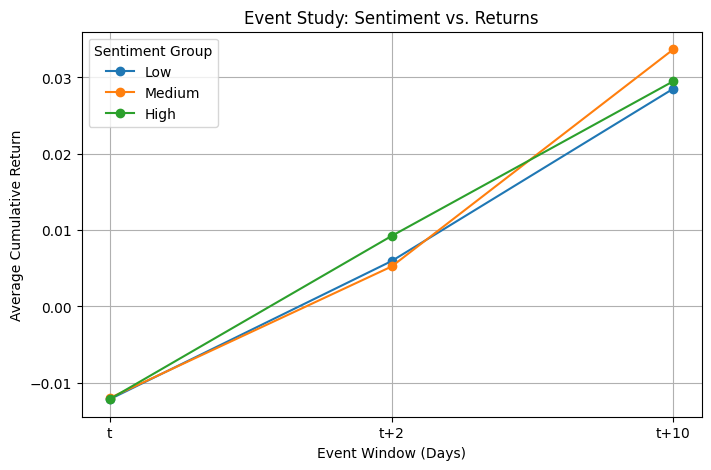
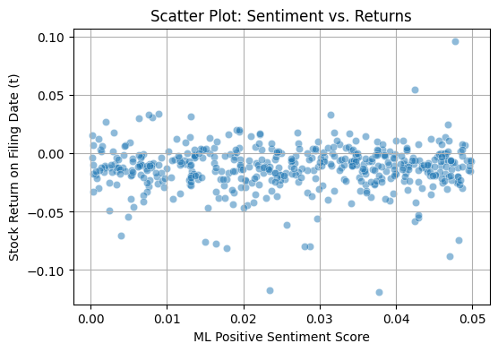
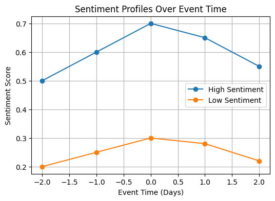

<!-- [Natural language processing 10-Ks to identify risks](/pdf/report.md) -->
<!-- 引入自定义样式和脚本 -->
<link rel="stylesheet" href="./assets/css/style.css">

<!-- 侧边栏和主内容区用HTML实现，内容用你的个人信息填充 -->

  

    

      

        
      

      <h1>Chris Luo</h1>
      
Student in Finance and Risk Management

    

    <nav>
      <ul>
        <li><a href="#about">About Me</a></li>
        <li><a href="#portfolio">Portfolio</a></li>
        <li><a href="#contact">Contact</a></li>
      </ul>
    </nav>
    

      <a href="https://www.linkedin.com/in/haonan-luo-562883231/" class="social-link">LinkedIn</a>
      <a href="https://github.com/Chris514" class="social-link">Github</a>
      <a href="mailto:your.email@example.com" class="social-link">Email</a>
    

  

  

    <section id="about" class="section">
      <h2>Personal Statement</h2>
      

        

          
Hello! My name is Haonan Luo. I am from China and currently finishing my undergraduate degree in Finance at Lehigh University, with a minor in Business Information Systems. In Fall 2025, I will begin my graduate studies in Enterprise Risk Management at Columbia University.

        

        

          
I have strong interests in finance, risk management, and data analysis. My internship experiences in China gave me hands-on skills working with large datasets, financial risks, and budget planning using tools like SQL, Excel, Tableau, and SAP. I have also worked with teams to develop risk strategies and support business decisions.

        

        

          
Outside of academics, I am active in the World Affairs Club and Formula SAE, which helped me improve my communication and teamwork abilities.

        

        

          
I am excited to continue my studies at Columbia, learn from top professors and classmates, and prepare for a career in risk management and finance.

        

      

    </section>
  <section id="portfolio" class="section">
    <h2>Portfolio</h2>
    </section>
    

      <!-- <h3>entiment in 10-K filings and stock returns</h3> -->
      

        <!-- <a href="./pdf/report.md" style="font-weight:bold; font-style:italic; font-size:1.1em;">
          entiment in 10-K filings and stock returns
        </a> -->
               <!-- <a href="https://nbviewer.org/github/Chris514/Chris514.github.io/blob/master/pdf/report.md" style="font-weight:bold; font-style:italic; font-size:1.1em;">
          entiment in 10-K filings and stock returns
        </a> -->
        <a href="/pdf/report.html" style="font-weight:bold; font-style:italic; font-size:1.1em;">
          entiment in 10-K filings and stock returns
        </a>
      

            
This project explores how the sentiment in companies’ 10-K filings affects their stock returns. By analyzing the text of 501 firms’ 10-K reports and measuring sentiment using established dictionaries and machine learning, we investigate how positive or negative language relates to stock performance before and after the filing date. The results show that negative sentiment in these filings is linked to lower short-term stock returns, while positive sentiment’s effect is less consistent. Overall, the study highlights the predictive value of financial sentiment for market reactions.

      

  

    

      <h3>Scatter Plot: Sentiment vs. Returns</h3>
            
This project visualizes the scatter relationship between machine learning sentiment scores and stock returns on the announcement date, exploring the immediate impact of sentiment scores on market reactions.

      
    

    

      <h3>Sentiment Profiles Over Event Time</h3>
            
This project plots the sentiment score trends of high and low sentiment groups within the event window, reflecting the sentiment dynamics of firms before and after major disclosures.

      
    

       <!-- <a href="https://nbviewer.org/github/Chris514/Chris514.github.io/blob/master/pdf/sample_presentation.pdf" class="btn" target="_blank">View on nbviewer</a> -->
  </section>

  <section id="contact" class="section">
    <h2>Contact</h2>
    
Email: haonanluo@outlook.com

  </section>
  

<footer>
  
© 2024 Chris Luo. Design: HTML5 UP.

</footer>

<!-- 如需自定义样式，请在assets/css/wide_style.scss中添加 -->
